# Lab from PKU Computer Network Course

- [Lab1 myFTP Protocol](#lab1-myftp-protocol)

[Lab2 RTP Based on UDP](#lab2-rtp-based-on-udp)

[Lab4 Switch](#lab4-switch)

# Lab1-myFTP Protocol

MyFTP is a simple Lab designed to help students quickly understand POSIX APIs.

In this lab, you will need to complete a simple FTP Server and a command-line interface (CLI) FTP Client.

## 1. Implementation Requirements

1. The MyFTP Client should support the following commands:
    1. `open <IP> <port>`: Establish a connection to `<IP>:<port>`.
    2. `auth <username> <password>`: Perform authentication with the server.
    3. `ls`: Retrieve a list of files in the current directory on the server side, an example output is as follows:
        ``` cpp
        123.txt
        ```
    4. `get <filename>`: Download the `<filename>` file from the server's running directory to the client's running directory with the same `<filename>`.
    5. `put <filename>`: Upload the `<filename>` file from the client's running directory to the server's running directory with the same `<filename>`.
    6. `quit`: Disconnect if connected, then close the client.
2. The MyFTP Server should support the following features:
    1. Access control: User login simplified to username `user` and password `123123`.
    2. Fetching file list: File list generation using the `ls` command, which may employ `popen` or `pipe+fork+execv` to obtain output from other processes.
    3. File download.
    4. File upload.

### 1.1 Client Operation

Based on the description in section "3. How to Test Locally," after compilation, it is expected to generate an executable `ftp_client` in the build directory. You can start the Client by executing `./ftp_client` directly in the build directory.

For actual testing, we will start `ftp_client` using its absolute path in any directory without any parameters.

### 1.2 Server Operation

Based on the description in section "3. How to Test Locally," after compilation, it is expected to generate an executable `ftp_server` in the build directory. You can start the Server by executing `./ftp_server 127.0.0.1 12323` in the build directory (the Server listens to 127.0.0.1:12323).

For actual testing, we will start `ftp_server` using its absolute path with IP and Port parameters as arguments, indicating the IP address and port the Server should listen to.

Here's a simple example: `cd /home/jeremyguo/tmp && /home/jeremyguo/ftp/build/ftp_server 127.0.0.1 12323`.

This command starts the `ftp_server` in the `/home/jeremyguo/tmp` directory.

## 2. Technical Specifications

### 2.1 Datagram Format

``` cpp
struct {
    byte m_protocol[MAGIC_NUMBER_LENGTH]; /* protocol magic number (6 bytes) */
    type m_type;                          /* type (1 byte) */
    status m_status;                      /* status (1 byte) */
    uint32_t m_length;                    /* length (4 bytes) in Big endian*/
} __attribute__ ((packed));
```

The Client and Server will exchange protocol information to perform various functions. All protocol messages are preceded by the protocol header shown in the code, communicated over the TCP protocol.

This means that every message on the 802.3 network will have the following form:

`|802.3 Header|IP Header|TCP Header|myFTP Header|myFTP Data|`

The TCP Header and previous headers will be generated by the system. What we need to implement is an application layer protocol, which is the content following the myFTP Header.

We add `__attribute__ ((packed))` to avoid issues that may arise due to data structure alignment.

### 2.2 myFTP Header Format

The document refers to requests as messages sent from the Client to the Server, and replies are messages sent from the Server to the Client.

For all messages, the `m_protocol` field in the myFTP Header should be set to `"\xe3myftp"` (which is the character '\xe3' followed by the string "myftp" for a total of 6 bytes). This field helps identify if the correct protocol version, i.e., myFTP protocol, is being used.

The `m_type` field identifies the type of message being sent, with specific values discussed in 2.3.

`m_status` will only be 0 or 1. The Server uses this option to inform the client of the current status, with specific values discussed in 2.3.

The message length `m_length` is represented in **big-endian** and includes the **total length** of both header and data. You can assume that the message length will never exceed `INT_MAX` defined in `limits.h`.

### 2.3 Functional Description

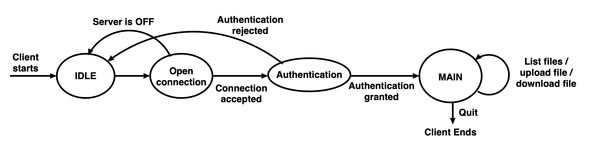

The above figure describes the Client's state machine. For each Client, as well as for the Server itself, a simple state machine should be maintained like this.

The Client can only execute one request at a time, and only after one request is completed can the next one begin.

#### 2.3.1 Open a Connection

The Client and Server interact in the following steps:

1. When a user starts the Client and enters the command `open SERVER_IP SERVER_PORT` (where `SERVER IP` and `SERVER_PORT` are the IP address and port number of the Server, respectively), a TCP connection should be established to the Server's IP address and port.
2. Next, the Client sends a protocol message `OPEN_CONN_REQUEST` to the Server, requesting to open a connection.
3. If the Server is running (i.e., listening to the Server's port number), it will reply with a protocol message of type `OPEN_CONN_REQUEST`.
4. Finally, the Client receives a reply from the Server.

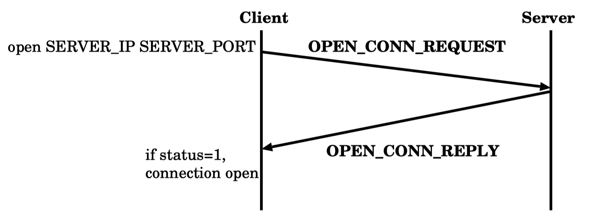

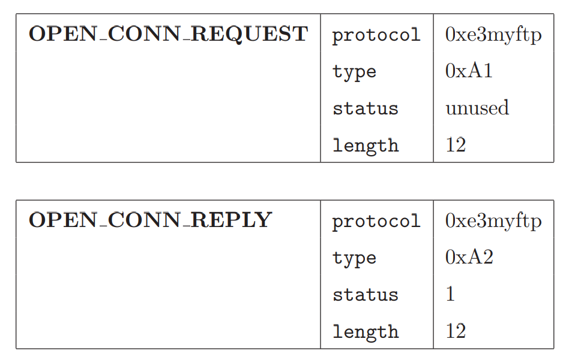

Please note:

1. When the Server starts, its `OPEN_CONN_REQUEST` type response has `m_status=1`.
2. When a field is described as unused, neither the Server nor the Server will read the content of that field.

#### 2.3.2 Authentication

After successfully connecting, users need to authenticate themselves with the command `auth USER PASS`.

`USER` and `PASS` are the username and password, respectively. Afterward, the Client sends an `AUTH_REQUEST` type of protocol message to the Server containing the username and password. For simplicity, the username is `user` and the password is `123123` at this time, the message's myFTP Data segment should be `"user 123123\0"`.

If authentication is successful, then the Server will reply with a message type `AUTH_REPLY`, and set `m_status` to 1.
Otherwise, the Server will reply with `AUTH_REPLY`, setting `m_status` to 0.

If the Client receives a status of 0, then it immediately closes the connection (i.e., reverts to the `IDLE` state in the state machine).

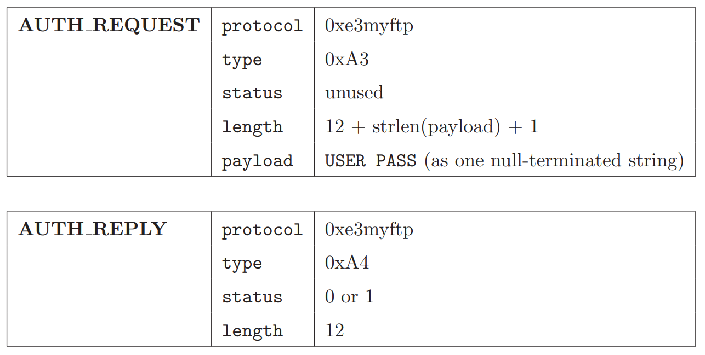

#### 2.3.3 List Files

After a user is authenticated, they can perform the primary functions. Suppose a user wants to list all files stored on the Server. The user will issue a `ls` command. The Client will then send a `LIST_REQUEST` type protocol message to the Server. The Server will reply with a `LIST_REPLY` protocol message along with a list of available files.

All files are stored in the program's working directory (note that the working directory is not equivalent to the executable's location but rather where the program was started from). Here are the assumptions about the repository directory:

1. The directory is created before the Server starts.
2. When the Server starts, the directory may contain files.
3. The directory contains only regular files (i.e., no subdirectories, no link files, etc.).
4. The Server process has the necessary permissions to access the directory and the files within it.
5. Files consist only of a set of characters: letters (a-z and A-Z) and numbers (0-9).
6. Executing the `ls` command in this directory, the total length of the returned result will not exceed 2047 characters.

To read the directory on the Server side, you can use `popen` to obtain the result of the execution of the `ls` program in Linux and return the result, noting that the end of the returned content should be added with a `\0` to indicate the end of the content.

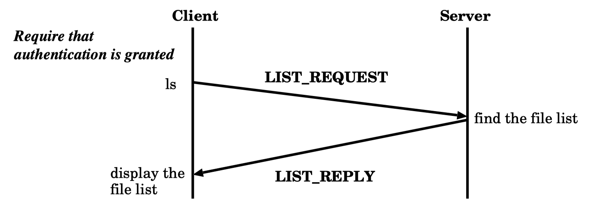

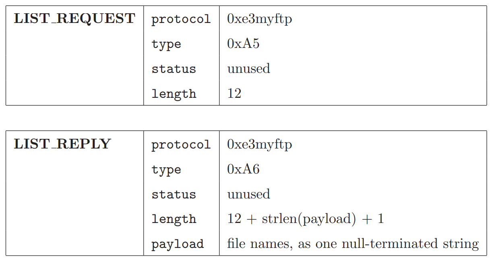

#### 2.3.4 Download Files

Suppose a user wants to download a file from the Server and issues a command `get FILE`, where `FILE` is the name of the file to be downloaded. The Client will then send a `GET_REQUEST` type protocol message to the Server. The Server will first check if the file is available in its repository directory.

If the file does not exist, the Server will reply with a `GET_REPLY` protocol message, with `m_status` set to 0.

If the file exists, the Server will reply with a `GET_REPLY` protocol message, with `m_status` set to 1, and a `FILE_DATA` message containing the file content.

Please note that a file can be in ASCII or binary mode. You should ensure that both ASCII and binary files are supported. Moreover, the program will overwrite any existing local file. Here, we assume that for each Client, only one file is downloaded at a time before the user issues the next command. The following figure shows the message flow for downloading a file.

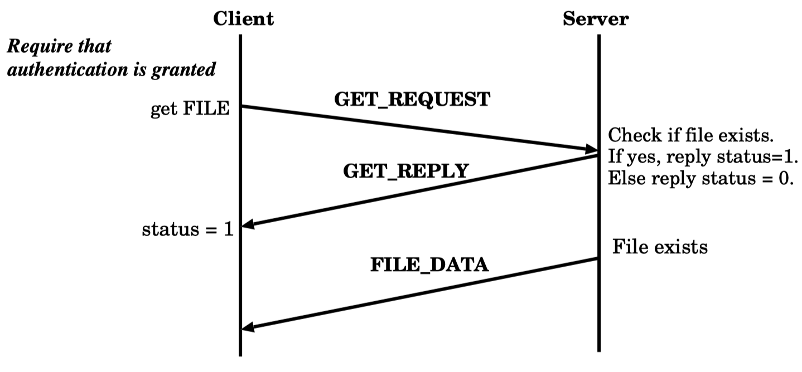

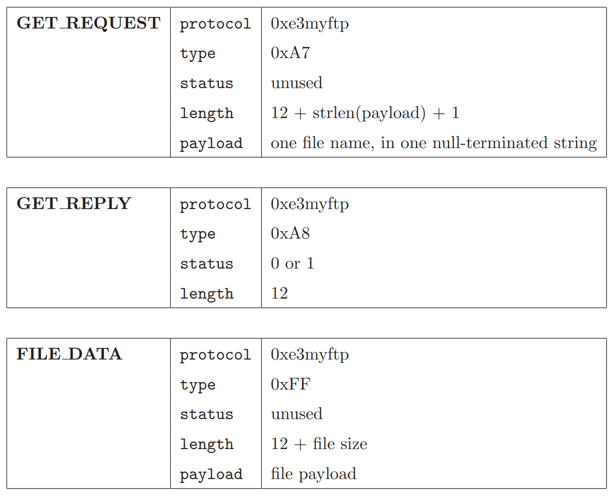

#### 2.3.5 Upload Files

The process you've outlined describes a typical upload interaction in a client-server application. The steps for the `put` command in your system work as follows:

1. The Client checks if the file exists locally. If it doesn't, it shows an error message stating that the file does not exist.
2. If the file exists locally, the Client sends a `PUT_REQUEST` message to the Server.
3. The Server responds with a `PUT_REPLY` message and waits for the file.
4. The Client sends the file content with a `FILE_DATA` message.

For implementing the file upload functionality considering the stated assumptions and processes, here is a conceptual overview of what each part of the application should do:

- **Client Side (for the `put FILE` command):**
  1. Verify local file existence.
  2. Send `PUT_REQUEST` to Server.
  3. On Server `PUT_REPLY`, send file content in `FILE_DATA` messages.

- **Server Side (on receiving `PUT_REQUEST`):**
  1. Send `PUT_REPLY` to acknowledge request.
  2. Receive the file content through `FILE_DATA` messages.
  3. Save the file in the working directory under the provided name, being aware of the possibility of overwriting existing files.

The considerations for the file being ASCII or binary are essential. To handle both types of files, you might want to open files in binary mode (`wb` for writing binary data in Python, for instance) to ensure that all byte content is handled correctly, without any alterations that text mode might cause.

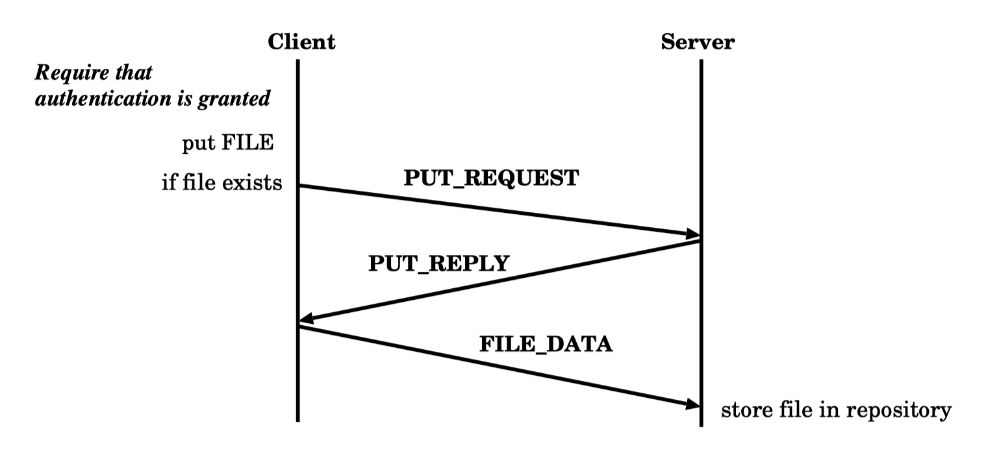

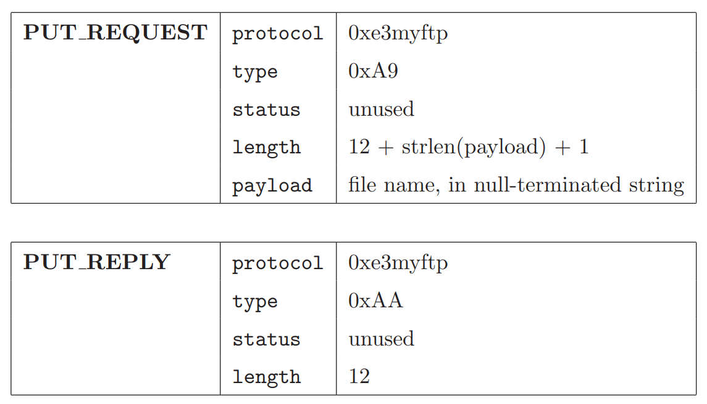

#### 2.3.6 Close Connection

Closing the connection follows the conventional request-reply pattern seen in other network protocols.

- **Client Side (for the `quit` command):**
  1. Send `QUIT_REQUEST` to Server.
  2. Upon receiving `QUIT_REPLY`, release the connection and close the TCP connection.
  3. Exit the Client program.

- **Server Side (on receiving `QUIT_REQUEST`):**
  1. Send `QUIT_REPLY`.
  2. Perform any necessary cleanup before closing the connection, if required.

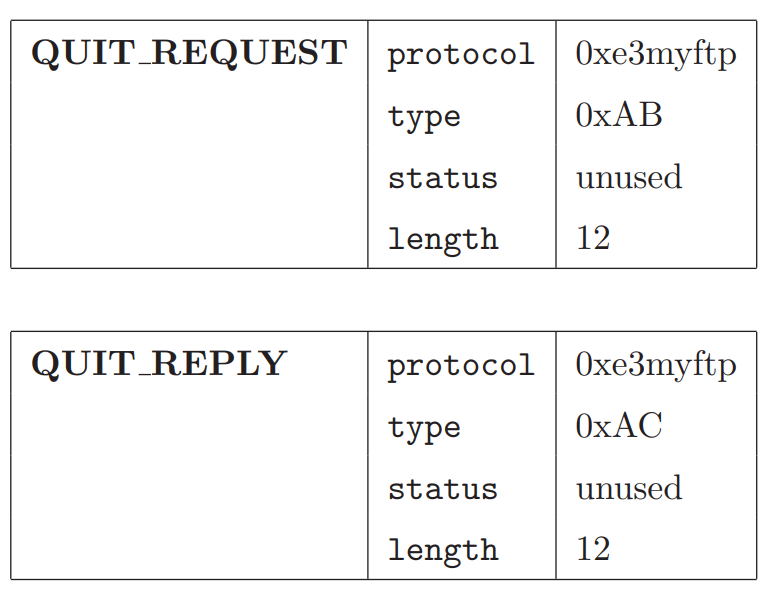

### 2.4 An Example of a Client

The example provided shows a standard interaction where a client follows a command-response pattern, reading inputs from `STDIN`. Clients can be designed with more elaborate or user-friendly interfaces but should adhere to the protocol specified.

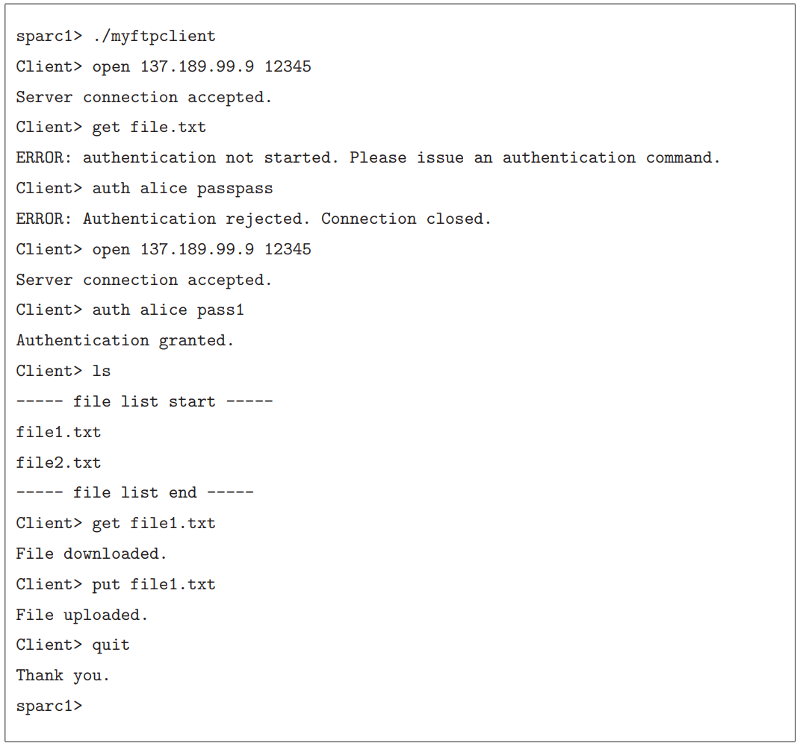

## 3. How to Perform Local Testing

### 3.1 Compilation Preparation

The instructions provided are for setting up a local testing environment using a provided repository from GitHub Classroom. Should there be any issues with testing, contacting the teaching assistant is advised.

#### 3.1.1 Repository Cloning

Following the steps for cloning and updating the repository should establish the local environment required for further steps in the testing process.

#### 3.1.2 Compiling the Test Program

Compiling the local test program involves creating a build directory within the `test_local` folder and running `cmake` and `make` to build the test executables. Copying the necessary files to the `build/` directory sets up the local testing environment.

### 3.2 Compilation

Running `make` within the `build` directory of the root folder compiles the client and server applications, resulting in the `ftp_client` and `ftp_server` executables being created.

### 3.3 Local Testing

Executing the `ftp_test` program from the build directory initiates the local testing procedure, which will simulate the client-server interaction and verify the correctness of the implemented protocol and functionalities.

## 4. Scoring

The total score for this Lab is 120 points.

Some test points will be released before the deadline, and others will be tested uniformly after the deadline, but we will describe in detail the characteristics of all test point data in the data point content.

Students can push the repository to Github for automated testing (only up to 90 points will be visible before the deadline).

The table below provides each test point's corresponding ID and content, which you can test against individually using `.\ftp_test --gtest_filter=ID`

Or use wildcards such as `.\ftp_test --gtest_filter=FTPServer.*` to test only the Server.

Each test point name consists of `${Category}.${Test Point Name}`

Unless otherwise specified, each test point runs with only one Client at a time.

<table>
    <tr>
        <th>Category</th>
        <th>Test Point Name</th>
        <th>Test Content</th>
        <th>Score Percentage</th>
        <th>Released Before Deadline</th>
        <th>Data Point Content</th>
    </tr>
    <tr>
        <td rowspan="9">FTPServer</td>
        <td>Open</td>
        <td>Test OPEN_REQUEST</td>
        <td>10</td>
        <td>Yes</td>
        <td>Receives a correct OPEN_REQUEST</td>
    </tr>
    <tr>
        <td>Auth</td>
        <td>Test AUTH_REQUEST</td>
        <td>10</td>
        <td>Yes</td>
        <td>Rejects unauthorized authentication and passes authorized authentication</td>
    </tr>
    <tr>
        <td>Get</td>
        <td>Test GET_REQUEST</td>
        <td>10</td>
        <td>Yes</td>
        <td>Retrieves a file of size 3 bytes with a filename no longer than 3 bytes, with randomly generated names and content</td>
    </tr>
    <tr>
        <td>Put</td>
        <td>Test PUT_REQUEST</td>
        <td>10</td>
        <td>Yes</td>
        <td>Uploads a file of size 3 bytes with a filename no longer than 3 bytes, with randomly generated names and content</td>
    </tr>
    <tr>
        <td>List</td>
        <td>Test LIST_REQUEST</td>
        <td>10</td>
        <td>Yes</td>
        <td>Retrieves a list of all files in a directory</td>
    </tr>
    <tr>
        <td>GetBig</td>
        <td>Test GET_REQUEST</td>
        <td>10</td>
        <td>No</td>
        <td>Retrieves a 1MB file with an 8-byte filename, with randomly generated names and content</td>
    </tr>
    <tr>
        <td>PutBig</td>
        <td>Test PUT_REQUEST</td>
        <td>10</td>
        <td>No</td>
        <td>Uploads a 1MB file with an 8-byte filename, with randomly generated names and content</td>
    </tr>
    <tr>
        <td>MultiPut</td>
        <td>Test PUT_REQUEST</td>
        <td>0</td>
        <td>Yes</td>
        <td>Four Clients execute FTPServer.Put concurrently</td>
    </tr>
    <tr>
        <td>MultiGet</td>
        <td>Test GET_REQUEST</td>
        <td>0</td>
        <td>Yes</td>
        <td>Four Clients execute FTPServer.Get concurrently</td>
    </tr>
    <tr>
        <td rowspan="6">FTPClient</td>
        <td>Open</td>
        <td>Test OPEN_REQUEST</td>
        <td>10</td>
        <td>Yes</td>
        <td>Successfully establishes a connection with the Server</td>
    </tr>
    <tr>
        <td>Auth</td>
        <td>Test AUTH_REQUEST</td>
        <td>10</td>
        <td>Yes</td>
        <td>Sends the correct username for verification and rejects the incorrect one</td>
    </tr>
    <tr>
        <td>Get</td>
        <td>Test GET_REQUEST</td>
        <td>10</td>
        <td>Yes</td>
        <td>Retrieves a file of size 3 bytes with a filename no longer than 3 bytes, with the filename and content generated randomly</td>
    </tr>
    <tr>
        <td>Put</td>
        <td>Test PUT_REQUEST</td>
        <td>10</td>
        <td>Yes</td>
        <td>Uploads a file of size 3 bytes with a filename no longer than 3 bytes, with the filename and content generated randomly</td>
    </tr>
    <tr>
        <td>GetBig</td>
        <td>Test GET_REQUEST</td>
        <td>5</td>
        <td>No</td>
        <td>Retrieves a 1MB file with an 8-byte filename, with the filename and content generated randomly</td>
    </tr>
    <tr>
        <td>PutBig</td>
        <td>Test PUT_REQUEST</td>
        <td>5</td>
        <td>No</td>
        <td>Uploads a 1MB file with an 8-byte filename, with the filename and content generated randomly</td>
    </tr>
</table>

# Lab2 RTP Based on UDP

## RTP Header
Each RTP packet contains an RTP header that follows immediately after the UDP header with the format specified below:

``` cpp
typedef struct RTP_Header {
    uint8_t type;
    uint16_t length;
    uint32_t seq_num;
    uint32_t checksum;
} rtp_header_t;
```

For simplicity, all fields in the RTP header are in little-endian byte order.

**type**: Identifies the type of RTP packet, with 0:`START`, 1:`END`, 2:`DATA`, 3:`ACK`

**length**: Indicates the length of the **data segment** of an RTP packet (i.e., the length of the packet following the RTP header). For `START`, `END`, and `ACK` type packets, the length is 0.

**seq_num**: A sequence number used to identify the order for sequential delivery.

**checksum**: A 32-bit CRC value calculated over the RTP header and the RTP data segment. Note that when calculating the checksum, the checksum field should be initialized to 0.

## Connection State

**Establishing Connection**: The `sender` initiates the connection by sending an RTP packet with type `START` and a `seq_num` as a random value. The sender then waits for an `ACK` packet with the same `seq_num`, and upon receipt, the connection is established.

**Data Transmission**: After the connection is established, the data to be sent is transmitted using `DATA` type packets. The `seq_num` for the sender's data packets starts at 0 and is incremented by 1 for each packet. Note that the `seq_num` used for data transmission is unrelated to the `seq_num` used for establishing the connection.

**Terminating Connection**: Once data transmission is complete, the sender sends a `END` type packet to terminate the connection. To ensure all data has been transmitted, the `seq_num` of the sender's `END` packet should match the `seq_num` of the next packet. The connection is disconnected after receiving an `ACK` packet with the matching `seq_num`.

## Other Information

**Packet Size**: When intending to transmit a set of data, it cannot be sent in one go as IP packets in the network typically do not exceed 1500 Bytes (otherwise they will be automatically fragmented), with a typical IP header being 20 bytes and the UDP header being 8 bytes. Therefore, you need to ensure that your RTP packet total length does not exceed 1472 bytes (RTP header + data).

<div STYLE="page-break-after: always;"></div>

## Part 1: Implementing `sender`

### Description
The `sender` should read the input message, send it to the specified recipient using the RTP protocol via a UDP socket.

The `sender` needs to split the input message into appropriately sized chunks and attach a `checksum` to each packet. Please use the 32-bit CRC calculation program provided in our `src/util.c` to add checksums to the packets.

The `seq_num` increases by 1 for every additional packet in the connection.

You will use a sliding window mechanism to implement reliable transmission. The `window_size` is a startup parameter that ensures the number of packets currently in transmission and not yet acknowledged by the `receiver` does not exceed the `window_size`.

After transmitting the entire message, the `sender` should send an `END` packet to mark the termination of the connection.

The `sender` must consider reliable transmission under the following network conditions:

* Packet loss occurring at any layer.
* Out-of-order arrival of `ACK` packets.
* Reception of arbitrary numbers of any packets multiple times.
* Delayed `ACK` packets.
* Corrupted packets.

Each `DATA` packet will be acknowledged by an `ACK` packet. To handle cases where `DATA` packets are lost or `ACK` packets are lost, you need to set a timer for automatic retransmission of unacknowledged `DATA` packets.

The timer is reset upon sliding window movement and, if reached 100ms, necessitates the retransmission of **all `DATA` packets in the current window**.

### Implementation Requirements

You are required to implement the following three functions in the `sender_def.c` program, all of which have been declared in `sender_def.h`.

``` cpp
/**
 * @brief Establishes an RTP connection
 * @param receiver_ip IP address of the receiver
 * @param receiver_port Port of the receiver
 * @param window_size Size of the window
 * @return -1 indicates connection failure, 0 indicates success
 **/
int initSender(const char* receiver_ip, uint16_t receiver_port, uint32_t window_size);

/**
 * @brief Sends data
 * @param message The name of the file to send
 * @return -1 indicates sending failure, 0 indicates success
 **/
int sendMessage(const char* message);

/**
 * @brief Terminates the RTP connection and closes the UDP socket
 **/
void terminateSender();
```

> The purpose of implementing these three functions is for ease of testing, as the test program will call these functions directly. Therefore, be careful not to use incorrect function definitions. Note that you do not need to implement a complete `sender`. Of course, you can use these functions to implement your own executable program for `sender`, which is straightforward.

> Please avoid using commands like `exit` within function implementations that cause the **process** to exit, as this would also stop the evaluation program from executing.

<div STYLE="page-break-after: always;"></div>

## Part 2: Implementing `receiver`

### Description

The `receiver` must accurately and completely receive and store the information sent by the `sender`. Note that this should only consider scenarios with a single `sender`.

The `receiver` is responsible for calculating the CRC32 `checksum`, and any packet with an incorrect `checksum` should be discarded.

For every `START` or `END` packet that is acknowledged received, you need to send an `ACK` packet, with `seq_num` as described in the "RTP Technical Specification."

For each `DATA` packet that is acknowledged received, an `ACK` packet should be sent, with `seq_num` set to the sequence number of the next expected `DATA` packet.

For example, there are the following two scenarios (assuming the next expected packet has a `seq_num` of N):

1. If the current packet has a `seq_num` greater than and not equal to N: receive and buffer the packet, and send an `ACK` with `seq_num`=N. Note that this differs slightly from the Go-Back-N (GBN) mechanism discussed in class. GBN discards out-of-order packets entirely, while here, the receiver buffers them, making the mechanism more efficient than GBN.

2. If the current packet's `seq_num` is equal to N: send an `ACK` with `seq_num`=M, where M is the smallest `seq_num` of the packet not yet buffered, and write all buffered packets to the file in order up to M (including the most recently received packet).

Packets with `seq_num` >= N + window_size should be directly discarded to ensure the `receiver` window size does not exceed `window_size`.

### Implementation Requirements

You should implement the following three functions in the `receiver_def.c` program, all of which have been declared in `receiver_def.h`:

``` cpp
/**
 * @brief Start the receiver and listen for connections on port across all IPs.
 * 
 * @param port The port that the receiver is listening to.
 * @param window_size The size of the window.
 * @return -1 indicates a connection failure, 0 indicates success.
 */
int initReceiver(uint16_t port, uint32_t window_size);

/**
 * @brief Receives data and then terminates the RTP connection after reception is complete.
 * @param filename The filename to receive data.
 * @return >0 represents the number of bytes of data received after completion, -1 represents other errors.
 */
int recvMessage(char* filename);

/**
 * @brief Terminates the RTP connection and closes the UDP socket in case of data reception failure.
 */
void terminateReceiver();
```

> The purpose of implementing these three functions is to facilitate testing. The test program will directly call these three functions, so please be careful not to use incorrect function definitions. Note, you do not need to implement a complete `receiver`; however, you can use these three functions to implement your own executable `receiver` program, which is not complicated.

> Please do not use commands like `exit` within the functions that cause the **process** to exit, as this will cause the evaluation program to stop running as well.

<div STYLE="page-break-after: always;"></div>

## Part 3: Implementing `opt_sender` and `opt_receiver`

### Description

In this section, you will make some modifications to the programs written in the previous parts. Consider how the programs written in the previous sections would behave in the following situation for a window size of 3 as shown below:

[The diagram is displayed]

In this situation, the receiver will return two `ACK` packets with a `seq_num` of 0, causing the sender to time out and retransmit `DATA` packets 0, 1, and 2. However, since the receiver has already received and buffered `DATA` packets 1 and 2, retransmitting these two packets is unnecessary.

To address this, you need to modify your `receiver` and `sender` accordingly:

* The `receiver` no longer sends cumulative `ACK` packets, meaning for every received `DATA` packet, the `receiver` no longer sends an `ACK` carrying the `seq_num` of the next expected `DATA` packet but sends an `ACK` with the same `seq_num` as the received `DATA` packet.

* The `receiver` still maintains an `N` representing the `seq_num` of the next expected `DATA` packet and should directly discard any `DATA` packets carrying a `seq_num` that is greater than or equal to `N+window_size`.

* The `sender` needs to keep track of all received `ACK` packets in the current window and only retransmit those `DATA` packets that have not been acknowledged upon timeout.

After optimization, in the previous example, as shown below, the optimized `sender` would wait until timeout and then only retransmit `DATA` packet 0.

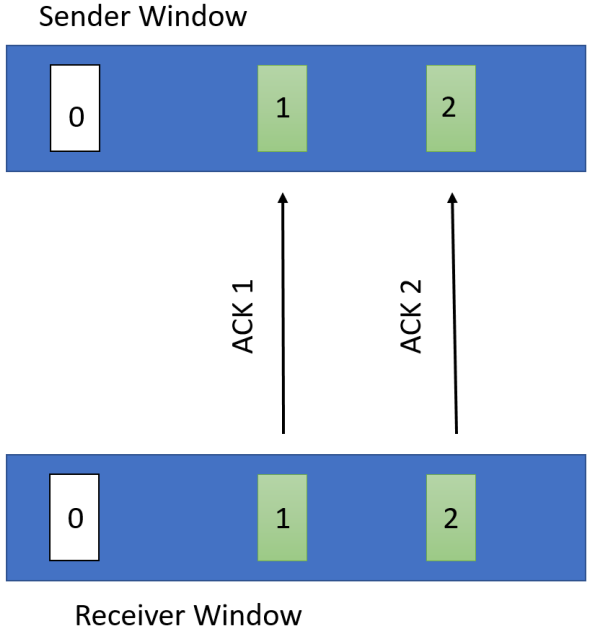

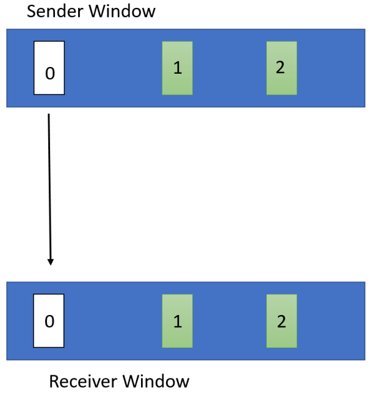

### Implementation Requirements

You should implement the following functions in `sender_def.c` and `receiver_def.c`. **Note that this function needs to be compatible with the previously written `initSender, initReceiver` and `terminateSender, terminateReceiver` functions**:

```cpp
/**
 * @brief Used for sending data (optimized version of RTP)
 * @param message The filename of the data to send
 * @return -1 indicates sending failed, 0 indicates sending success
 **/
int sendMessageOpt(const char* message);

/**
 * @brief Used for receiving data and then disconnecting the RTP connection after completion (optimized version of RTP)
 * @param filename The filename for receiving data
 * @return >0 indicates the byte count of data received after completion, -1 indicates other errors occurred
 */
int recvMessageOpt(char* filename);
```

> The purpose of implementing these two functions is to facilitate testing. The test program will directly call these functions, so be careful not to use the wrong function definitions. To be able to execute separately, you can also use these functions to implement your own executable program for `opt_sender` and `opt_receiver`, which is not complicated.

> Please do not directly use commands like `exit` inside the function that causes the **process** to exit, as this would cause the evaluation program to stop executing as well.

<div STYLE="page-break-after: always;"></div>

## Testing

### Explanation

All test filenames will not exceed 100 characters in length and only contain the 26 letters `a-z`.

The data size for transmission does not exceed `100MB`, and its character set consists of the union of any characters of the char type.

The window sizes of `sender` and `receiver` are the same and do not exceed `512`.

All test points have a one-to-one `sender` and `receiver`.

The test `sender` will have the following four types of transmission faults: 1) Loss of `DATA` packets, 2) Out-of-order `DATA` packets, 3) Duplicate `DATA` packets, 4) `DATA` packets with checksum errors.

The test `receiver` will have the following four types of transmission faults: 1) Loss of `ACK` packets, 2) Out-of-order `ACK` packets, 3) Duplicate `ACK` packets, 4) `ACK` packets with checksum errors.

There are 26 test points before the deadline, two of which have no transmission faults and test the implementation of the original and optimized RTP protocol, respectively.

The remaining 24 test points are divided into four groups of six, testing the optimized/non-optimized versions of `sender`/`receiver`. For each group of faults, the six test points are respectively for individual categories 1-4 transmission faults, a small mix of categories 1-4 transmission faults, and a large mix of categories 1-4 transmission faults. Note that 1) any fault category may appear repeatedly, 2) due to window size settings, these 24 test points are all likely to experience natural packet loss faults, the first two without transmission faults are not affected.

After the deadline, 10 new test points will be added, including larger windows, more extensive data, and higher fault probabilities, but all follow the above descriptions.

Each test point has the same score.

### Code

The provided source code mainly contains the following parts:

1) The `third_party` folder contains the source code of googletest, which does not require modification.
2) `CMakeLists.txt` is a usable CMake template. After implementing `sender_def.c`, `receiver_def.c`, `rtp.c` (where I define some necessary functions), execute `cmake .` and `make` to compile all the code. `rtp.c` is not mandatory; you can selectively use these files based on actual needs, and you can also modify `CMakeList.txt` to meet your specific requirements.
3) The `src` folder contains header files for each function definition and RTP packet header formats.

### Test

After compiling all the code, execute `make test CTEST_OUTPUT_ON_FAILURE=TRUE GTEST_COLOR=TRUE` to conduct local testing. Each test point has the same score.

If you want to test a single test point, you can call ./rtp_test_all --gtest_filter=`Test point name`, for example, `./rtp_test_all --gtest_filter=RTP.OPT_RECEIVER_TEST_LOST_DATA`.

For details on the specific test files called at each test point, please see the source code of test.cpp.

The image below is an example of a successful test:


<div STYLE="page-break-after: always;"></div>

To modify test files, go to the https://github.com/N2Sys-EDU/Lab2-RTP-Test repository and download all executable files with the prefix test.

## Special Case Handling

During the actual implementation of this protocol, because it is not a fully reliable connection-oriented protocol, there are many bugs. Hence, we have supplemented the following handling for special cases:

> This is also why TCP requires a three-way handshake and a four-way disconnection process. We hope everyone can think this through in the process of completing this lab.

### `sender`

1. If the `ACK` packet of the `START` type is lost and the `sender` times out, by which time the `receiver` has already established a connection and is ready to receive data, the `sender` should directly send an `END` packet to the `receiver`.
2. If the `sender` determines that the `ACK` packet of the `START` type is corrupted, it should directly send an `END` packet to the `receiver`.
3. If the `ACK` packet of the `END` type is lost, the `sender` will conclude the process upon timeout.

### `receiver`

1. Set a timeout period (recommended to be 10 seconds). If no packet is received within this time, it is assumed that the connection has been closed.
2. If the `checksum` of the `START` packet is incorrect, the `receiver` process should exit immediately.

# Lab4 Switch

## 0. Introduction

In Lab4, you will be required to implement a simple Layer 2 switch that is capable of performing straightforward forwarding, broadcasting, and learning of forwarding tables.

Specifically, you will need to implement your switch class as a C++ class. A single-process simulator will be used for simulation and testing purposes. This simulator will instantiate one or more objects of your switch class, forming a virtual physical link topology with virtual hosts within the simulator. The simulator will invoke interfaces of your implemented switch class to accomplish the forwarding of Ethernet frames, broadcasting, and learning of the switch's forwarding tables.

## 1. Network Architecture

To simplify the lab, we will only consider the link layer within the network. The following agreements are made:

1. Each host in the network has a **unique** MAC address for identification.
2. The experiment will only involve frame transmission at the link layer and will not cover protocols in the network layer and above.
3. The experiment will only simulate single-threading and will not involve multi-thread testing.

It's important to note that we will use a simulator to model the network environment, not actual environment testing, which means you do not need to program using sockets.

## 2. Functional Requirements

This section primarily describes the functionality that needs to be implemented in the lab's switch.

In a nutshell, upon receiving a frame from the link layer, the switch must determine the forwarding port based on the destination MAC address in the frame header. Also, the switch should automatically learn the forwarding table by updating the mapping between the frame's incoming port and the source MAC address.

### 2.1 Forwarding and Learning the Forwarding Table

We expect your switch to correctly forward frames and learn the forwarding table.

More specifically, when your switch receives a frame from a port `inPort`, it will check the frame's destination MAC address and look for the corresponding outgoing port `outPort` in the forwarding table. Your switch should handle the following situations:

(1) If it is a control frame from the controller, the switch should execute the above instructions and then discard it.
(2) If the corresponding forwarding port number cannot be found, broadcast the frame to other ports excluding the incoming port while recording the mapping of the incoming port and the frame's source MAC address.
(3) If the corresponding forwarding port `outPort` is found and `outPort == inPort`, the frame should be discarded.
(4) If the corresponding forwarding port `outPort` is found and `outPort != inPort`, forward the frame to the port `outPort`.

### 2.2 Aging of the Switch Forwarding Table

Your switch should implement an aging feature.

Specifically, your switch should be able to age entries in its forwarding table to adapt to changes in the physical link status. In addition to recording the destination MAC address and corresponding outgoing port, each table entry in the forwarding table should also have a timestamp. Each time the forwarding table is learned, initialize the timestamp if a new entry is inserted, or update the timestamp if an existing entry is refreshed. The switch can set an aging time to delete any entries that have not been refreshed after exceeding this time.

To simulate aging, you should equip each forwarding table entry with an `int` type variable `counter` and implement aging as follows:

- Upon inserting a new entry, initialize the corresponding `counter` to 10 (corresponding to an aging time of 10 seconds).
- If an existing entry is being inserted, reset the `counter` to 10.
- When the switch receives an `Aging` control command from the Controller, it should decrement the `counter` by 1 for all entries in the forwarding table, removing any entries from the table whose `counter` has reached 0.


### 2.3 Controller

The Controller is responsible for notifying the switch to age the entries in its forwarding table. It achieves this by sending control frames.

For testing purposes, the switch class you implement must be able to handle control frames from the Controller and perform the appropriate actions. Control frames from the Controller will be passed to the switch just like other data frames, through the Simulator invoking class member functions.

We will describe the specifics of the control frames in section 3.3.

## 3. Technical Specifications

### 3.1 Frame Format

In `Lab 4`, each frame consists of a header + Payload, with each frame containing only one header.

To differentiate frames coming from hosts and those from the controller, we refer to frames sent from hosts as **data frames** and frames from the controller containing control commands as **control frames**. **Please note: Both control and data frames adhere to the frame format described in this section.**

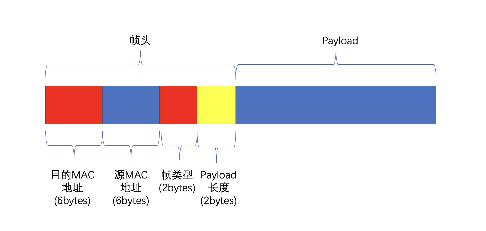

We use a 6-byte `uint8_t` array to represent a MAC address. For readability, we use typedef to define an alias for the MAC address as `mac_addr_t`, which you can find in the `types.h` file.

```c
// In "types.h"
typedef uint8_t mac_addr_t[6];
```

The frame header in `Lab 4` follows the definition below, which you can also find in the `types.h` file.

```cpp
// In "types.h"

typedef struct {
  mac_addr_t ether_dest;
  mac_addr_t ether_src;
  uint16_t ether_type;
  uint16_t length;
} ether_header_t;
```

Here, the `ether_dest` field occupies 6 bytes and represents the **destination MAC address** of the frame.

The `ether_src` field also occupies 6 bytes and represents the **source MAC address** of the frame.

The `ether_type` field occupies 2 bytes and indicates the type of frame. In `Lab 4`, there are two different types of frames involved: data frames and control frames, corresponding to the following two possible values for `ether_type`:

```c
const uint16_t ETHER_DATA_TYPE = 0;
const uint16_t ETHER_CTRL_TYPE = 1;
```

For `ETHER_DATA_TYPE`, it indicates that this is a **data frame**, and its payload contains communication data between hosts.

For `ETHER_CTRL_TYPE`, such frames are only issued by the Controller, indicating that this is a **control frame**. We will introduce control frames in section 3.3.

The `length` field occupies 2 bytes and indicates the length of the payload.

**Note: Both `ether_type` and `length` are represented using little-endian format.**

We guarantee that the size of each message sent during testing will not exceed **1500 bytes**, so the total size of an individual frame will not exceed the 16 bytes of the frame header + a maximum of 1500 bytes of the message = **1516 bytes**.

### 3.2 Control Frames and Control Commands

A control frame refers to the frame received by a switch from the Controller that contains the Controller's control commands.

A control command refers to the control information contained within a **control frame**. Your switch only needs to support the single control command `AGING`.

Upon receiving this command, the switch should immediately age the entries in its forwarding table.

In terms of format, the `AGING` command **does not have an additional payload**; it carries no information other than the frame header, with the header's length field set to 0.

## 4. Implementation Requirements

### 4.1 Switch Interface

For ease of testing, you are **required** to implement your switch program according to the given class interface.

Specifically, the abstract class `SwitchBase` for the switch is defined in the provided file `switch.h`, as shown in the following code snippet.

```C++
class SwitchBase {
public:
    virtual void InitSwitch(int numPorts) = 0;
    virtual int ProcessFrame(int inPort, char* framePtr) = 0;
}
```

Your implemented switch class must inherit from the above pure virtual class and implement the two pure virtual functions described above.

The following will explain the parameters and their meanings for these two pure virtual functions.

### 4.1.1 InitSwitch(int numPorts)

The `InitSwitch` function is used to initialize the state of the switch, with the following parameter significance:

- `numPorts` indicates the number of ports on this switch, ensuring that `numPorts` is greater than 0.

**Note: As with Lab3, we stipulate that port numbers start from 1. Specifically, each switch's port number 1 is linked to the Controller.**

### 4.1.2 ProcessFrame(int inPort, char* framePtr)

The `ProcessFrame` function is responsible for handling and forwarding the frames received by the switch. It contains two parameters:

- `inPort` indicates the port number where the frame was received.
- `framePtr` is a pointer to the received frame, which conforms to the frame format specified in section 3.1.

The return value of `ProcessFrame` indicates the port number to which this frame should be forwarded. In particular:

- A return port number of `-1` indicates that the frame should be discarded.
- A return port number of `0` means that the frame should be broadcast to all other ports except the incoming port.

**Note:**

**1. Do not free the framePtr inside the ProcessFrame function.**

**2. After processing the AGING frame from the controller, the switch should directly discard this frame. That is, for control frames from the controller, your switch's ProcessFrame function should return -1.**

## 4.2 Simulator Workflow

Next, we will introduce the workflow of the simulator, which will call your implemented switch according to the interface agreed upon above.

During testing, the simulator will proceed with the following logic:

1. The Simulator creates a Controller.
2. The Simulator calls the `CreateSwitchObject` function multiple times according to the corresponding physical topology to create multiple switch instances and uses the `InitSwitch` function to complete the initialization of each switch.
3. For each switch, the Simulator will first check if there are any unprocessed frames in its corresponding buffer; if so, it will call the `ProcessFrame` function for processing the frame, which may involve broadcasting, forwarding, or discarding the frame.
4. Before officially starting the test, the test program will ensure to send messages between pairs of hosts in the network to allow each switch to learn the correct port forwarding (testing will not occur at this stage).
5. When officially starting the test, the test program will generate some random Payloads and assemble them into frames for testing. At the same time, the Simulator will track the forwarding path of these frames.
6. The test program will check whether these frames have been correctly forwarded.

In steps 1 and 2, the Simulator creates a Controller instance and multiple switch instances to simulate a real-machine environment. To allow the Simulator to create your defined switch class, we declare a helper function in `switch.h` as follows:

```cpp
SwitchBase *CreateSwitchObject();
```

You should implement this function so that each call creates a new instance of your implemented Switch and returns this pointer. For example, suppose the switch class you implemented is `EthernetSwitch`:

```cpp
class EthernetSwitch : public SwitchBase {
public:
  void InitSwitch(int numPorts) override { /* your implementation ... */ }
  int ProcessFrame(int inPort, char* framePtr) override { /* your implementation ... */ }
};
```

Then you should implement the following function:

```cpp
SwitchBase * CreateSwitchObject() {
  return new EthernetSwitch();
}
```

## 5. Local Testing and Running

We use the same method as in `lab3` for local testing and running of code.

We provide an automated test program, and each student has a separate Github repository after accepting the Github Classroom invitation.

If you cannot test normally, please contact the teaching assistant.

### 5.1. Obtaining the Repository

1. Clone from the remote repository.
2. Execute `git submodule update --init` in the root directory.
3. Execute `git submodule update --remote` in the root directory.
4. Execute `mkdir build` in the root directory.

### 5.2. Compiling the Test Program

We have provided a local test program, if you want to test locally, please follow these steps:

1. In the root directory, execute `cd test_local && mkdir build && cd build && cmake .. && make`, which will compile the local test program.
2. Copy the file `test_local/build/lab4_test` to `build/`, which you only need to do once when first getting the test program or after the test program is updated.

Note, if the test program is updated, please perform the following command to get the latest test program (we will notify through the teaching website and WeChat group):

Execute `git submodule update --remote` in the root directory and re-execute steps 1 and 2 above.

### 5.3. Compiling Your Program

We issued a CMake template in the template repository; you can modify `CMakeList.txt` to add source files.

**Note that there should be a distributed static library `liblab4runtime.a` in the `test_local` directory. Before compiling, you need to copy this file to the `build/` directory in the root directory.**

If `liblab4runtime.a` is updated, you will need to execute `git submodule update --remote` in the root directory and then copy it back to `build/`.

We compile `switch.cc` into a static library and link `liblab4runtime.a` with `libswitch.a` to the `simulator` to create a complete executable simulator program. You can compile and test your switch locally by executing the `cmake .. && make` command in the `build` directory at the root.

Please do not modify the `simulator.cc` provided in the issued files and ensure that `liblab4runtime` is linked before `libswitch` during linking. Otherwise, normal testing will not be possible.

### 5.4. Debug Mode

For ease of debugging, we provide a debug mode for `simulator`.

You can run the debug mode by executing `./simulator 0`. In this mode, you can consider `simulator` as providing a simulator that runs the `controller` and `switch`. You can debug using the commands listed below.

**Note that the frames sent in 2-3 below are executed directly by the controller and will not be sent to the switch's buffer; when executing 4/5/6/7, `ProcessFrame()` will be called. Meanwhile, 8 will immediately call `ProcessFrame()` and recursively track the forwarding path of the frame.**

1. `new <num_port>` Create a new switch. Consistent with the parameter of `InitSwitch()`, the `simulator` will return the number of the created switch (positive integer). This command will create a Switch instance and call `InitSwitch()` to initialize the switch.
2. `link <switch_id> <switch_id>` Connect two switches specified by the switch number returned in 1, where the port number will be selected by the controller.
3. `addhost <switch_id> <addr>` Connect a host to the corresponding switch with the MAC address `<addr>`.
5. `aging` Send an `AGING` control frame to all switches.
6. `n` Make all switches take a frame from their corresponding input buffer and perform one forwarding operation.
7. `ns` Continuously perform step 8 until there are no more frames to forward in the network.
7. `warmup` Send random messages between pairs of hosts in the network so that before the official test starts, each switch can learn the correct port forwarding rules.
8. `hostsend <src_addr> <dst_addr> <payload>` Send a frame from host `<src_addr>` to `<dst_addr>`, `<payload>` is an optional field. The `simulator` will return the length of the forwarding path for the corresponding frame in this network, along with src_addr, dst_addr, payload.
9. `exit` Exit the program.

For example, the following input sequence can serve as an example:

```
new 4
addhost 1 de:ad:be:ef:00:01
addhost 1 de:ad:be:ef:00:02
addhost 1 de:ad:be:ef:00:03
warmup
hostsend de:ad:be:ef:00:01 de:ad:be:ef:00:02 HelloFromHost1ToHost2
```

Lines 1-4 actually establish the following physical link:

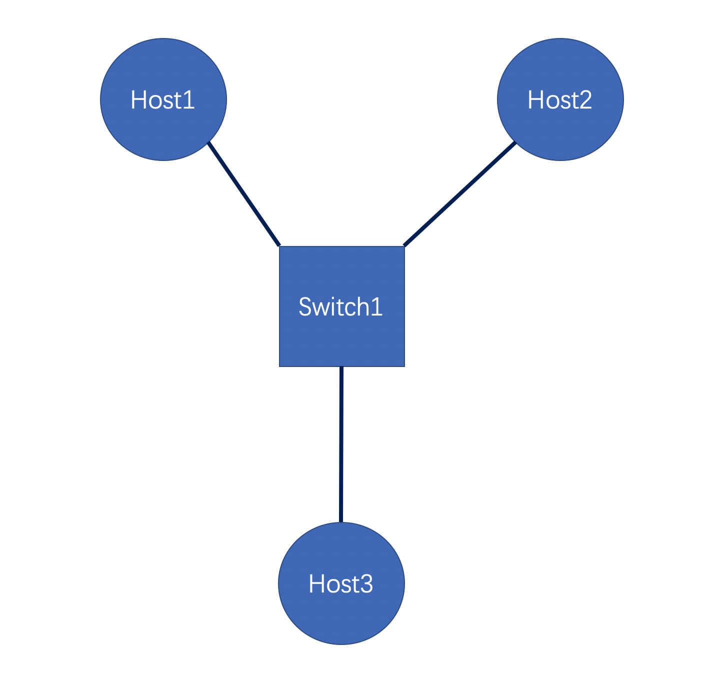

Line 1 creates a switch with 4 ports (note: port 1 is reserved for the controller).

Lines 2-4 connect three hosts with MAC addresses de:ad:be:ef:00:01, de:ad:be:ef:00:02, and de:ad:be:ef:00:03, respectively, to the remaining three ports of this switch.

Line 5 uses the `warmup` command to send messages between Hosts 1, 2, and 3, to preheat the forwarding table of Switch 1 so that it can learn the correct forwarding ports for each host.

Line 6 officially starts the message sending.

## 6. Test Case Description

This lab has a total of 110 points, with some test points being released before the deadline, and all test points being tested uniformly after the deadline.

### 6.1 Test Case Description

Each test point name consists of `${Category}.${Test Point Name}`

All the test case links' topologies are guaranteed to be connected and will only have tree-like topologies (that is, there will be no cycles).

In all test cases, it is guaranteed that the number of switches does not exceed 20 and the number of hosts does not exceed 100.

In all test cases, it is guaranteed that there will be no illegal control frames.

All test cases will ensure that the MAC address used by the controller will not conflict with other hosts' MAC addresses.

| Category   | Test Point Name | Score | Released Before Deadline | Contents of Data Point                      |
| ---------- | --------------- | ----- | ------------------------ | ------------------------------------------- |
| Topology1  | Forwarding      | 10    | Yes                      | Only tests forwarding                       |
| Topology1  | SwitchAging     | 10    | Yes                      | Only tests aging on the premise of correct forwarding |
| Topology2  | Forwarding      | 10    | Yes                      | Only tests forwarding                       |
| Topology2  | SwitchAging     | 10    | Yes                      | Only tests aging on the premise of correct forwarding |
| Topology3  | Forwarding      | 10    | Yes                      | Only tests forwarding                       |
| Topology3  | SwitchAging     | 15    | Yes                      | Only tests aging on the premise of correct forwarding |
| Topology4  | Forwarding      | 10    | Yes                      | Only tests forwarding                       |
| Topology4  | Mixed           | 15    | Yes                      | Tests forwarding and switch aging simultaneously |
| Topology5  | Mixed           | 10    | No                       | Tests forwarding and switch aging simultaneously |
| Topology6  | Mixed           | 10    | No                       | Tests forwarding and switch aging simultaneously |